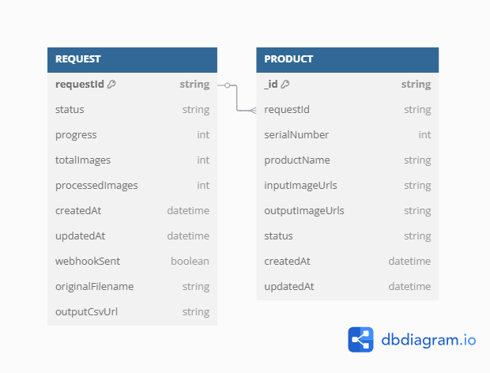

# Image Processing System

A Node.js application that processes images from CSV files asynchronously.

## Features

- Upload CSV files with product information and image URLs
- Validate CSV format
- Process images asynchronously (compress to 50% quality)
- Store processed data in MongoDB
- Generate output CSV with processed image URLs
- Check processing status with a unique request ID
- Webhook notifications when processing is complete

## Tech Stack

- Node.js with Express
- MongoDB (NoSQL database)
- Bull (job queue)
- Redis (message broker)
- Sharp (image processing)

## Structure

```
root/
├── src/
│   ├── config/
│   │   ├── db.js               # Database connection
│   │   └── redis.js            # Redis connection for Bull
│   ├── controller/
│   │   ├── uploadController.js # Handles file upload
│   │   └── statusController.js # Handles status check
│   ├── middleware/
│   │   └── csvValidator.js     # Validates CSV format
│   ├── models/
│   │   ├── Request.js          # Request model
│   │   └── Product.js          # Product model
│   ├── service/
│   │   ├── csvService.js       # Parses CSV
│   │   ├── imageService.js     # Processes images
│   │   └── webhookService.js   # Handles webhooks
│   ├── queues/
│   │   └── imageProcessingQueue.js # Queue for image processing
│   ├── workers/
│   │   └── imageProcessor.js   # Worker for processing images
│   ├── routes/
│   │   └── api.js              # API routes
│   └── app.js                  # Main application file
├── .env                        # Environment variables
├── package.json                # Dependencies
└── README.md
```

## Prerequisites

- Node.js
- MongoDB
- Redis

## Installation

1. Clone the repository
```bash
git clone https://github.com/yourusername/image-processing-system.git
cd image-processing-system
```

2. Install dependencies
```bash
npm install
```

3. Configure environment variables
```bash
cp .env.example .env
```
Edit the `.env` file with your configuration.

4. Start the application
```bash
npm start
```

For development:
```bash
npm run dev
```

## Database Schema



## API Documentation

### Upload CSV

```
POST /api/upload
```

Upload a CSV file with product information and image URLs.

**Request Body:**
- `file`: CSV file (multipart/form-data)

**Response:**
```json
{
  "success": true,
  "requestId": "unique-request-id",
  "message": "File uploaded successfully. Processing started."
}
```

### Check Status

```
GET /api/status/:requestId
```

Check the status of a processing request.

**Response:**
```json
{
  "success": true,
  "data": {
    "requestId": "unique-request-id",
    "status": "processing",
    "progress": 45,
    "totalImages": 10,
    "processedImages": 4,
    "createdAt": "2023-10-10T10:15:30.000Z",
    "updatedAt": "2023-10-10T10:16:20.000Z"
  }
}
```

## CSV Format

### Input CSV Format
```
S. No.,Product Name,Input Image Urls
1,SKU1,https://www.public-image-url1.jpg,https://www.public-image-url2.jpg
2,SKU2,https://www.public-image-url1.jpg,https://www.public-image-url2.jpg
```

### Output CSV Format
```
S. No.,Product Name,Input Image Urls,Output Image Urls
1,SKU1,https://www.public-image-url1.jpg,https://www.processed-image-url1.jpg
2,SKU2,https://www.public-image-url1.jpg,https://www.processed-image-url2.jpg
```

## Webhook Integration

To enable webhook notifications, set the `WEBHOOK_URL` environment variable.

The webhook will receive a POST request with the following payload when processing is complete:

```json
{
  "requestId": "unique-request-id",
  "status": "completed",
  "totalImages": 10,
  "processedImages": 10,
  "outputCsvUrl": "http://localhost:3000/processed/unique-request-id-output.csv",
  "completedAt": "2023-10-10T10:20:45.000Z"
}
```